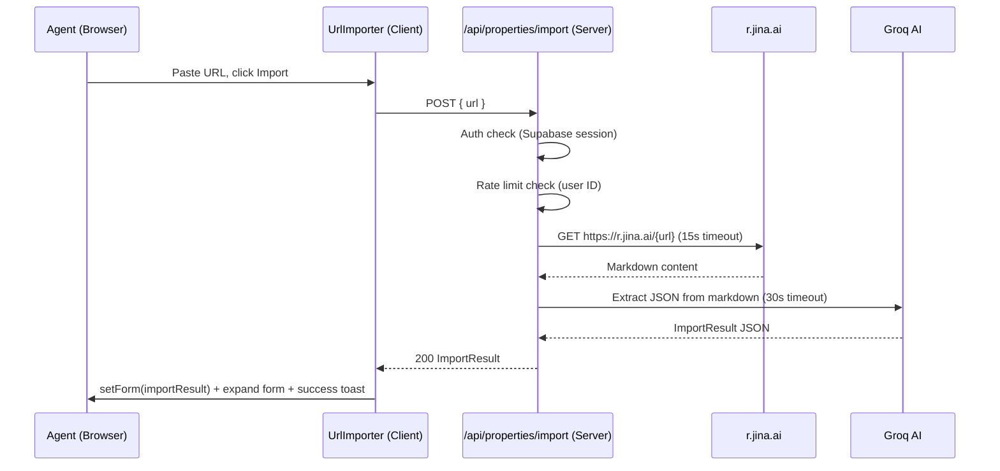
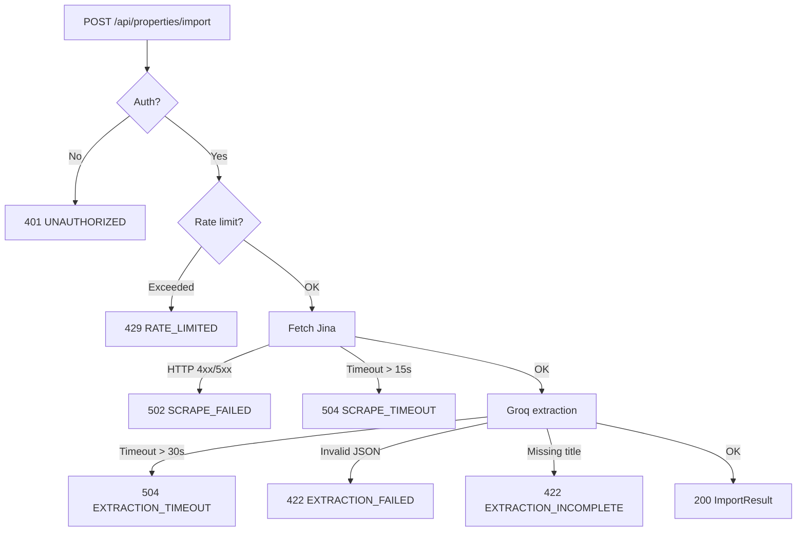

# Design Document: Listing URL Import

## Overview

The Listing URL Import feature adds a URL-based auto-fill capability to the Properties page. An agent pastes any property listing URL (Njuškalo, Crozilla, Index oglasi, or any agency website) into a small importer widget embedded in the add-form area. The system fetches the page via Jina AI reader, extracts structured property data with Groq AI, and pre-populates the existing add form so the agent can review and save with minimal typing.

The feature is entirely additive — it does not modify the existing property save/edit flow, only pre-fills the form state that already exists.

### Key Design Decisions

- **Jina AI reader** (`https://r.jina.ai/{url}`) is used for scraping because it requires no API key, handles JavaScript-rendered pages, and returns clean markdown — ideal for feeding to an LLM.
- **Groq AI** (same client already used for reply generation) performs structured JSON extraction from the markdown. Using `response_format: { type: 'json_object' }` ensures parseable output.
- **No new DB table** is needed — the import is a transient operation that only populates client-side form state.
- **Rate limiting** reuses the existing `rateLimit` utility (Upstash Redis, 10 req / 60 s per user ID) to keep costs controlled.
- **The `UrlImporter` component** is a self-contained client component that receives a `setForm` callback from the Properties page, keeping it decoupled from the form's internal state management.

---

## Architecture



### Error paths



---

## Components and Interfaces

### `UrlImporter` (Client Component)

**Location:** `components/properties/UrlImporter.tsx`

```typescript
interface UrlImporterProps {
  // Callback to populate the add form; receives partial EditForm values
  onImport: (result: ImportResult) => void
  // Whether the parent form is currently being submitted (blocks import)
  formSubmitting?: boolean
  // Controlled: whether the add form is currently shown (to expand it on success)
  onExpandForm?: () => void
}
```

Responsibilities:
- Renders URL `<input>` and "Import from URL" `<button>`
- Validates URL format client-side (must start with `http://` or `https://`)
- Calls `POST /api/properties/import` with `{ url }`
- On success: calls `onImport(result)` then `onExpandForm?.()` then shows success toast
- On error: maps error code to i18n toast message, re-enables button

### `POST /api/properties/import` (API Route)

**Location:** `app/api/properties/import/route.ts`

Request body:
```typescript
{ url: string }
```

Success response (`200`):
```typescript
interface ImportResult {
  title: string
  address: string | null
  city: string | null
  price: number | null
  sqm: number | null
  rooms: number | null
  description: string | null
  property_type: 'apartment' | 'house' | 'land' | 'commercial' | 'other'
}
```

Error response (all error cases):
```typescript
interface ApiError {
  error: string
  code: 'UNAUTHORIZED' | 'RATE_LIMITED' | 'SCRAPE_FAILED' | 'SCRAPE_TIMEOUT' | 'EXTRACTION_FAILED' | 'EXTRACTION_INCOMPLETE' | 'EXTRACTION_TIMEOUT' | 'INVALID_URL'
}
```

### Properties Page Integration

The existing `PropertiesPage` component passes a callback to `UrlImporter`:

```typescript
// Inside PropertiesPage, above the add form:
<UrlImporter
  onImport={(result) => {
    setForm({
      title: result.title,
      address: result.address ?? '',
      city: result.city ?? '',
      price: result.price ? String(result.price) : '',
      sqm: result.sqm ? String(result.sqm) : '',
      rooms: result.rooms ? String(result.rooms) : '',
      description: result.description ?? '',
      property_type: result.property_type,
    })
  }}
  onExpandForm={() => setShowForm(true)}
/>
```

This keeps `UrlImporter` stateless with respect to the form — it only fires callbacks.

---

## Data Models

### `ImportResult`

The canonical shape returned by the API and consumed by the form callback:

```typescript
interface ImportResult {
  title: string                  // required — extraction fails without this
  address: string | null
  city: string | null
  price: number | null           // EUR, numeric
  sqm: number | null             // square meters, numeric
  rooms: number | null           // numeric
  description: string | null
  property_type:
    | 'apartment'
    | 'house'
    | 'land'
    | 'commercial'
    | 'other'
}
```

### Groq Extraction Prompt Shape

The prompt instructs Groq to return exactly this JSON schema:

```
Return a JSON object with these fields:
- title: string (property name/headline, required)
- address: string or null (street address)
- city: string or null
- price: number or null (EUR; convert from other currencies if possible)
- sqm: number or null (square meters)
- rooms: number or null
- description: string or null (max 500 chars, plain text)
- property_type: one of "apartment" | "house" | "land" | "commercial" | "other"

Return ONLY the JSON object, no explanation.
```

### i18n Keys (new keys to add)

**`locales/en.json`** — under `"properties"`:
```json
"import_url_label": "Import from URL",
"import_url_placeholder": "https://www.njuskalo.hr/...",
"import_url_btn": "Import",
"import_url_importing": "Importing...",
"import_url_success": "Form pre-filled from listing. Review and save.",
"import_url_invalid": "Please enter a valid URL (starting with https://)",
"import_url_error_scrape": "Could not fetch the listing. Check the URL and try again.",
"import_url_error_extract": "Could not extract property details. Please fill the form manually.",
"import_url_error_rate": "Too many import requests. Please wait a moment.",
"import_url_error_generic": "Import failed. Please try again."
```

**`locales/hr.json`** — under `"properties"`:
```json
"import_url_label": "Uvezi s URL-a",
"import_url_placeholder": "https://www.njuskalo.hr/...",
"import_url_btn": "Uvezi",
"import_url_importing": "Uvoz u tijeku...",
"import_url_success": "Obrazac popunjen iz oglasa. Pregledajte i spremite.",
"import_url_invalid": "Unesite valjani URL (mora počinjati s https://)",
"import_url_error_scrape": "Nije moguće dohvatiti oglas. Provjerite URL i pokušajte ponovo.",
"import_url_error_extract": "Nije moguće izvući detalje nekretnine. Ispunite obrazac ručno.",
"import_url_error_rate": "Previše zahtjeva za uvoz. Pričekajte trenutak.",
"import_url_error_generic": "Uvoz nije uspio. Pokušajte ponovo."
```

---

## Correctness Properties

*A property is a characteristic or behavior that should hold true across all valid executions of a system — essentially, a formal statement about what the system should do. Properties serve as the bridge between human-readable specifications and machine-verifiable correctness guarantees.*

### Property 1: URL validation enables/disables the import button

*For any* string input into the URL field, the import button SHALL be enabled if and only if the string starts with `http://` or `https://`.

**Validates: Requirements 1.2**

---

### Property 2: Jina URL construction

*For any* valid URL submitted to the API route, the outbound fetch SHALL target exactly `https://r.jina.ai/{url}` — the Jina reader prefix concatenated with the original URL.

**Validates: Requirements 2.1**

---

### Property 3: Markdown pass-through to extractor

*For any* markdown string returned by Jina reader, the same string SHALL be passed verbatim to the Groq extraction call without modification or truncation beyond what the prompt requires.

**Validates: Requirements 2.2**

---

### Property 4: HTTP error codes map to SCRAPE_FAILED / 502

*For any* HTTP status code in the range 400–599 returned by Jina reader, the API route SHALL respond with HTTP 502 and error code `SCRAPE_FAILED`.

**Validates: Requirements 2.3**

---

### Property 5: Extraction prompt completeness

*For any* markdown content sent to Groq, the prompt SHALL include all required field names (`title`, `address`, `city`, `price`, `sqm`, `rooms`, `description`, `property_type`) and the full `property_type` enum constraint.

**Validates: Requirements 3.1, 3.2, 3.3, 3.4, 3.5**

---

### Property 6: Invalid JSON from Groq maps to EXTRACTION_FAILED / 422

*For any* string returned by Groq that is not parseable as valid JSON, the API route SHALL respond with HTTP 422 and error code `EXTRACTION_FAILED`.

**Validates: Requirements 3.6**

---

### Property 7: Missing title maps to EXTRACTION_INCOMPLETE / 422

*For any* valid JSON object returned by Groq that does not contain a non-empty `title` field, the API route SHALL respond with HTTP 422 and error code `EXTRACTION_INCOMPLETE`.

**Validates: Requirements 3.7**

---

### Property 8: Form auto-fill maps all non-null fields

*For any* `ImportResult` returned by the API, every non-null field in the result SHALL appear as the corresponding form field value after `onImport` is called, and every null field SHALL leave the corresponding form field as an empty string.

**Validates: Requirements 4.1, 4.2, 4.3**

---

### Property 9: Error response always restores UI to interactive state

*For any* error response from the API (any error code, any HTTP status), the `UrlImporter` component SHALL re-enable the import button and clear the loading indicator after the response is received.

**Validates: Requirements 6.1, 6.5**

---

### Property 10: Rate limit enforcement

*For any* authenticated user, after 10 successful import requests within a 60-second window, all subsequent requests within that window SHALL return HTTP 429 with error code `RATE_LIMITED`.

**Validates: Requirements 5.2**

---

## Error Handling

### API Route Error Table

| Condition | HTTP Status | Error Code |
|---|---|---|
| No valid Supabase session | 401 | `UNAUTHORIZED` |
| Rate limit exceeded | 429 | `RATE_LIMITED` |
| Request body missing `url` or invalid format | 400 | `INVALID_URL` |
| Jina returns 4xx or 5xx | 502 | `SCRAPE_FAILED` |
| Jina request exceeds 15 s | 504 | `SCRAPE_TIMEOUT` |
| Groq response is not valid JSON | 422 | `EXTRACTION_FAILED` |
| Groq JSON missing `title` | 422 | `EXTRACTION_INCOMPLETE` |
| Groq request exceeds 30 s | 504 | `EXTRACTION_TIMEOUT` |
| Unexpected server error | 500 | `IMPORT_FAILED` |

### Client-Side Error Mapping

```typescript
function getErrorMessage(code: string, t: (k: string) => string): string {
  switch (code) {
    case 'SCRAPE_FAILED':
    case 'SCRAPE_TIMEOUT':
      return t('properties.import_url_error_scrape')
    case 'EXTRACTION_FAILED':
    case 'EXTRACTION_INCOMPLETE':
    case 'EXTRACTION_TIMEOUT':
      return t('properties.import_url_error_extract')
    case 'RATE_LIMITED':
      return t('properties.import_url_error_rate')
    default:
      return t('properties.import_url_error_generic')
  }
}
```

### Timeout Strategy

- **Jina fetch**: `AbortController` with `setTimeout(abort, 15_000)`. The `finally` block always clears the timer.
- **Groq call**: Uses the same pattern already established in `lib/groq/client.ts` — `AbortController` with `setTimeout(abort, 30_000)`. The import route calls Groq directly (not via `generateReplies`) with a dedicated extraction prompt.

### Security Considerations

- The raw markdown from Jina is **never logged or stored** — it is used only as an in-memory string passed to Groq.
- The `url` parameter is validated server-side (must be a parseable `URL` with `http:` or `https:` protocol) before being appended to the Jina endpoint, preventing SSRF to internal addresses.
- Auth is checked before any external call is made.

---

## Testing Strategy

### Unit Tests (example-based)

Focus on concrete scenarios and edge cases:

- `UrlImporter` renders input and button
- Import button is disabled when input is empty
- Import button is disabled during loading
- Successful import calls `onImport` with correct shape and calls `onExpandForm`
- Success toast is shown after import
- Error toast is shown for each error code
- Form fields are editable after auto-fill (not read-only)
- API route returns 401 for unauthenticated requests
- API route returns 504 / `SCRAPE_TIMEOUT` when Jina times out
- API route returns 504 / `EXTRACTION_TIMEOUT` when Groq times out

### Property-Based Tests

Uses **fast-check** (already compatible with the TypeScript/Jest/Vitest stack). Each property test runs a minimum of 100 iterations.

**Property 1 — URL validation** (`Feature: listing-url-import, Property 1: URL validation enables/disables the import button`)
- Generator: arbitrary strings + arbitrary valid http/https URLs
- Assert: `isValidUrl(s) === s.startsWith('http://') || s.startsWith('https://')`

**Property 2 — Jina URL construction** (`Feature: listing-url-import, Property 2: Jina URL construction`)
- Generator: arbitrary valid http/https URL strings
- Assert: captured fetch URL === `https://r.jina.ai/${inputUrl}`

**Property 3 — Markdown pass-through** (`Feature: listing-url-import, Property 3: Markdown pass-through to extractor`)
- Generator: arbitrary non-empty strings (simulating markdown)
- Assert: Groq call receives the exact same string as Jina returned

**Property 4 — HTTP error codes → SCRAPE_FAILED** (`Feature: listing-url-import, Property 4: HTTP error codes map to SCRAPE_FAILED / 502`)
- Generator: integers in [400, 599]
- Assert: response status 502, body `{ code: 'SCRAPE_FAILED' }`

**Property 5 — Extraction prompt completeness** (`Feature: listing-url-import, Property 5: Extraction prompt completeness`)
- Generator: arbitrary markdown strings
- Assert: prompt string contains all 8 field names and the 5 enum values

**Property 6 — Invalid JSON → EXTRACTION_FAILED** (`Feature: listing-url-import, Property 6: Invalid JSON from Groq maps to EXTRACTION_FAILED / 422`)
- Generator: arbitrary strings filtered to exclude valid JSON
- Assert: response status 422, body `{ code: 'EXTRACTION_FAILED' }`

**Property 7 — Missing title → EXTRACTION_INCOMPLETE** (`Feature: listing-url-import, Property 7: Missing title maps to EXTRACTION_INCOMPLETE / 422`)
- Generator: arbitrary objects without a `title` key, serialized to JSON
- Assert: response status 422, body `{ code: 'EXTRACTION_INCOMPLETE' }`

**Property 8 — Form auto-fill mapping** (`Feature: listing-url-import, Property 8: Form auto-fill maps all non-null fields`)
- Generator: arbitrary `ImportResult` objects with random null/non-null field combinations
- Assert: after `onImport(result)`, each form field equals `result[field] ?? ''`

**Property 9 — Error restores UI** (`Feature: listing-url-import, Property 9: Error response always restores UI to interactive state`)
- Generator: arbitrary error response objects (random code, random status)
- Assert: after response, button is enabled and loading is false

**Property 10 — Rate limit enforcement** (`Feature: listing-url-import, Property 10: Rate limit enforcement`)
- Generator: integers N in [11, 50] (number of requests)
- Assert: first 10 succeed (or pass through), request N returns 429 `RATE_LIMITED`
- Note: use mocked `rateLimit` utility to avoid Upstash dependency in tests
